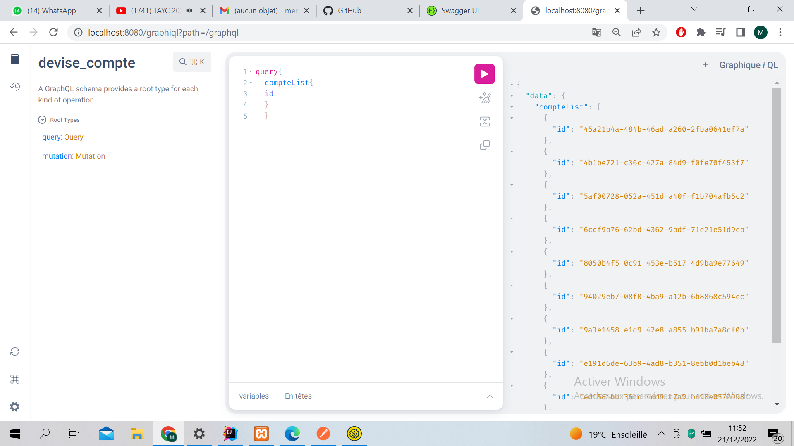

<h1>Rapport du projet</h1>

Le projet est strucuturé sur différente couche

<ul>
<li>Couche WEB</li>
<li>Couche Service</li>
<li>Couche DAO</li>
</ul>
<h2>Teste de la couche web en utilisant  Postman</h2>

<h2>Teste de la documentation Swagger de des API Rest du Web service</h2>

<h2>Teste du web service avec GraphQL</h2>

Ajout d'un nouveau compte

